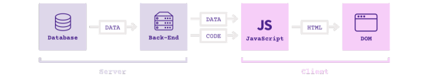

# JsNoteBooks
> 网络上摘抄的笔记

## JavaScript引用的框架结构

为了理解当前JavaScript应用的复杂性，我们首先需要了解他们是如何运作的。

首先我们看一下2008年标准的Web应用的构成：

1. 数据库为后端提供数据（后端可以是PHP或Rails等）；
2. 后端解析数据并输出HTML；
3. HTML被发送到浏览器，以网页的形式展示。

现在这类应用也有一些客户端的JS代码，用来增加交互（例如标签、模态窗口等），但本质上，浏览器仍是从服务器获取HTML的内容。

现在拿当前2016年的Web应用（也称作：单页面应用）与之比较：

